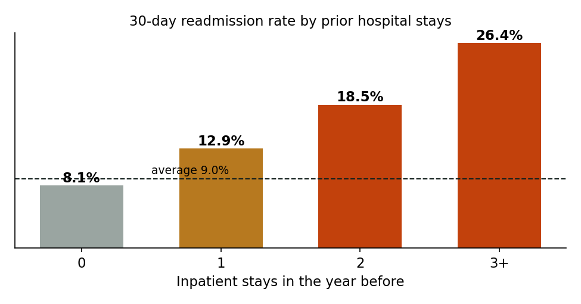
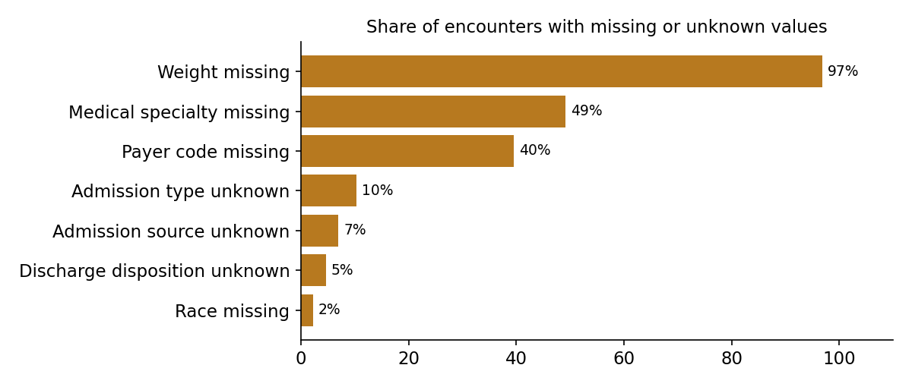
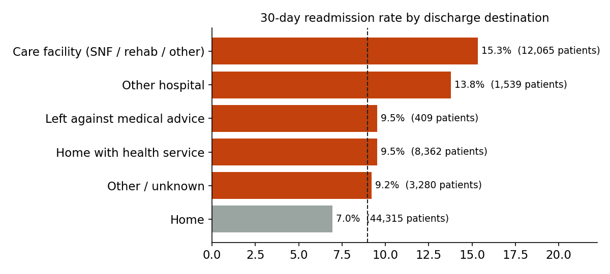
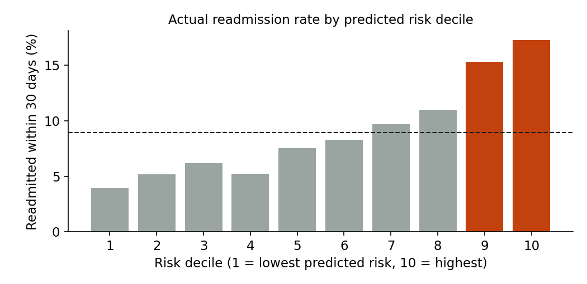

# Readmission Watch: which diabetic patients come back to hospital within 30 days?

**Business question:** *Which diabetic patients are most likely to be readmitted within 30 days, and where should the hospital focus follow-up care after discharge?*

Readmissions are costly for patients and hospitals. In the US, the Hospital Readmissions Reduction Program (HRRP) fines hospitals with high readmission rates, and in Germany readmissions are a quality indicator as well. This project analyses **101,766 real, de-identified hospital stays** of diabetic patients in 130 US hospitals. It covers data quality, readmission drivers, a risk model, and a re-test of a result from the original research paper.

**Interactive case study:** _add your published link here_
**Stack:** SQL (DuckDB), Python (pandas, scikit-learn, statsmodels, Matplotlib), Chart.js

**Data:** [Diabetes 130-US Hospitals for Years 1999–2008](https://archive.ics.uci.edu/dataset/296/diabetes+130-us+hospitals+for+years+1999-2008), UCI Machine Learning Repository, CC BY 4.0.
Strack B. et al. (2014), *Impact of HbA1c Measurement on Hospital Readmission Rates: Analysis of 70,000 Clinical Database Patient Records*, BioMed Research International.

---

## Key results

| | |
|---|---|
| Patients in the analysis cohort (first stay per patient) | **69,970** |
| Readmitted within 30 days | **8.97%** (6,277 patients) |
| Readmission rate with 3+ hospital stays in the prior year vs none | **26.4% vs 8.1%** |
| Discharged to a care facility vs home | **15.3% vs 7.0%** |
| Risk model (logistic regression), test set AUC | **0.64** |
| Readmissions caught by following up the top 20% highest-risk patients | **36%** (1.8× better than random) |
| Patients who got an HbA1c test during the stay | **18%** |
| HbA1c tested vs not, main diagnosis diabetes | **7.2% vs 10.2%** readmitted (adjusted OR 0.82, 95% CI 0.67–1.01) |



### Recommendations
1. **Follow-up programme:** use the model at discharge to select the top 20% highest-risk patients for a follow-up call or early clinic visit. Following up that 20% reaches about 36% of all readmissions.
2. **Discharge planning:** patients going to care facilities (SNF, rehab) are readmitted about twice as often as patients going home. Handover to these facilities is a priority.
3. **HbA1c testing:** only 18% of diabetic patients were tested. Make it routine for patients admitted mainly for diabetes, and measure the effect in a pilot. The data here is observational, so it can't prove the test causes fewer readmissions.
4. **Data capture:** weight is missing for 97% of stays and medical specialty for 49%. Recording these would improve any future model.

---

## Approach

### 1. Data quality (`sql/00_data_quality_checks.sql`)
The raw data uses `?` for missing values and codes such as "NULL", "Not Mapped" and "Not Available" in the lookup tables.



| Issue | Rows | Handling |
|---|---|---|
| Weight missing | 98,569 (97%) | column dropped |
| Payer code missing | 40,256 (40%) | column dropped |
| Medical specialty missing | 49,949 (49%) | kept as `Unknown` |
| Repeat stays of the same patient | 30,248 | first stay per patient only, so observations are independent |
| Died or discharged to hospice | 2,423 | excluded: these patients cannot be readmitted |
| Gender `Unknown/Invalid` | 3 | excluded |
| Unknown admission type / source / discharge codes | 10,396 / 7,067 / 4,680 | grouped as `Unknown` |
| Orphan codes (no match in lookup tables) | 0 | checked with `LEFT JOIN` |

**Cohort:** 101,766 stays → 71,518 patients → **69,970** after exclusions. This is close to the 69,984 reported in the original paper.

### 2. Staging and joins (`sql/01_staging.sql`)
- Joins the three lookup tables (admission type, admission source, discharge disposition).
- Groups ICD-9 diagnosis codes into chapters (circulatory, respiratory, diabetes, …) and turns the age bands into numbers.
- Builds the cohort with `ROW_NUMBER() OVER (PARTITION BY patient_nbr ORDER BY encounter_id)`.

### 3. Readmission drivers (`sql/02_readmission_profile.sql`)
One long table gives the readmission rate by age, diagnosis, admission source, discharge destination, prior visits, length of stay and HbA1c testing.



### 4. Risk scoring (`sql/03_risk_score.sql`, `analysis/model_and_stats.py`)
- **Simple score in SQL:** adapted from the LACE index (Length of stay, Acuity, Comorbidity, Emergency visits). Comorbidity uses the number of diagnoses as a proxy, because the Charlson index isn't in the data.
- **Logistic regression** on 20 variables known at discharge, with a 75/25 stratified train/test split.

| Method | AUC | Readmissions caught in top 20% |
|---|---|---|
| Logistic regression | 0.64 | 36.3% |
| LACE-style score (SQL) | 0.55 | 24.3% |
| Prior inpatient stays only | 0.54 | 27.3% |

An AUC of 0.64 is in the usual range for this dataset (published work mostly reports 0.60–0.70). Readmission depends on what happens after discharge, and much of that isn't in hospital records.



### 5. Re-testing a published finding (`sql/04_hba1c_analysis.sql`, `analysis/model_and_stats.py`)
The paper reported that HbA1c measurement was linked to lower readmission, depending on the main diagnosis. I re-tested this with logistic regression, adjusting for age, length of stay, prior visits, number of diagnoses, admission source and discharge destination:

| Main diagnosis | Patients | Not tested | Tested | Adjusted OR [95% CI] | p |
|---|---|---|---|---|---|
| Diabetes | 5,748 | 10.2% | 7.2% | 0.82 [0.67–1.01] | 0.059 |
| Circulatory | 21,383 | 9.5% | 10.2% | 1.05 [0.93–1.18] | 0.423 |
| Respiratory | 9,486 | 7.7% | 5.5% | 0.76 [0.61–0.94] | 0.013 |
| All patients | 69,970 | | | 0.95 [0.89–1.02] | 0.175 |

- **Across all patients:** no significant link after adjustment.
- **By diagnosis:** the link differs between diabetes and circulatory patients (interaction p = 0.013), in the same direction as the paper reported.
- **Caveat:** this is an association in observational data, not a causal effect.

---

## Project structure
```
├── data/
│   ├── download_data.py          # downloads the dataset (UCI, with mirror fallback)
│   └── raw/                      # diabetic_data.csv + 3 lookup tables (not committed)
├── sql/
│   ├── 00_data_quality_checks.sql
│   ├── 01_staging.sql
│   ├── 02_readmission_profile.sql
│   ├── 03_risk_score.sql
│   └── 04_hba1c_analysis.sql
├── analysis/model_and_stats.py   # model, statistics, charts
├── dashboard/                    # interactive HTML case study
├── outputs/                      # result tables (CSV) and charts (PNG)
└── run_pipeline.py               # runs all SQL on DuckDB
```

## How to run
```bash
pip install -r requirements.txt
python data/download_data.py          # 1. get the data
python run_pipeline.py                # 2. data quality + SQL pipeline
python analysis/model_and_stats.py    # 3. model + statistics + charts
python dashboard/build_dashboard.py   # 4. interactive page
```

## Limitations
- US data from 1999–2008, so care practice has changed since then.
- Readmissions to other hospitals aren't recorded, which means the true rate is likely higher.
- The HbA1c analysis shows associations, not cause and effect. Unmeasured factors (for example, which doctors order the test) can bias it.
- Next steps: gradient-boosted trees, probability calibration, and cost-based choice of the follow-up threshold.

---
*Author: Sonam Rohilla · [LinkedIn](https://www.linkedin.com/in/sonam-rohilla-09418723)*
